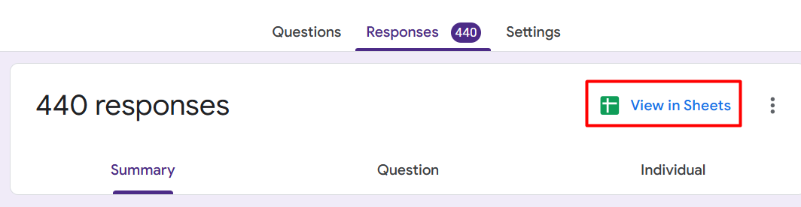
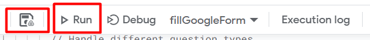

# This JavaScript code will help you to auto response your google form data.

## Here is the step by step to get unlimited response from people


**1. Go to your google form in the response tab click on View in sheets**
##



**2. In google sheets, click on extension**
##


**3. Click on Apps Script**
##


**4. Copy and paste the code the code from code.js**
##


**5. Change formUrl**
``` bash 
const formUrl = "https://docs.google.com/forms/d/1TyTcCMeNZuBcYkMRTP4acZ76HO_G0y74Zx3-BitTUew/edit"
```


**6. Change the question and option for for your google form**

- You have to manually enter all the question and options for this. I know this is hassle.

``` bash 
const responses = {
      "this is": {
        values: [1, 2, 3, 4, 5], // linear scale question
        weights: [0.20, 0.30, 0.10, 0.25, 0.15], // Weighted percentages for each option
      },
      "Which one is the JavaScript extension?": { // Multiple choice question
      values: ['.js', '.ejs', '.mjs', 'All'],
      weights: [0.50, 0.10, 0.20, 0.20],
    },
    "Which one is the JavaScript extension?":{ // checkbox question
        values: [[".js"],[".js",".ejs"],[".js",".ejs",".mjs"]],
        weights: [0.50, 0.10, 0.20, 0.20],
    },
    "What is your favorite color?": { // Short answer question
      values: ['Red', 'Blue', 'Green', 'Yellow', 'Purple'],
      weights: [0.30, 0.25, 0.15, 0.20, 0.10], 
    }
    };

```

**8. Change the response number according to your need**
``` bash 
for (let i = 0; i < 5; i++) { // Generate 5 responses }
```


**9. Save and finally run the code**
##


- It may ask for google sign in just allow your google account. If you have multiple account in you machine, it will work only one account. If you try work with other account, you might get error.

## Be alert that you exactly copy and paste the question and options other wise it will not work

**Finally if everything is okay, go to your google form and see the response and benefit the magic. Without the hassle of sending out to a large number of people to fill out the data.**
